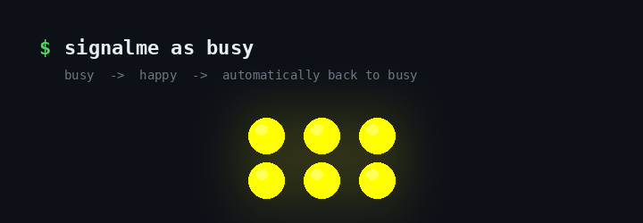

# SignalMe

[](https://github.com/Reefact/signalme/actions/workflows/ci.yml)
[](https://www.nuget.org/packages/SignalMe)
[](LICENSE)

SignalMe is a tiny command-line companion for Luxafor devices. Set your availability, trigger expressive
light signals, and automate your workplace status without a GUI.



<sub>Rendered from the LED sequence the code actually produces, slowed down to be readable. Not a
recording of a device.</sub>

```shell
signalme as busy      # solid yellow, and it stays there
signalme as happy     # rainbow signal, then back to busy on its own
signalme status       # busy
signalme off          # lights out
```

## Why SignalMe?

- **No GUI.** One command, from any shell, script or automation.
- **Expressive.** Durable availability statuses, plus temporary light signals for the moment.
- **Safe restoration.** A signal always puts your durable status back — including when it fails, and when
  you interrupt it.

## Install

SignalMe targets .NET 10 and runs on Windows. Installing it as a global .NET tool requires the
[.NET 10 SDK](https://dotnet.microsoft.com/download/dotnet/10.0): `dotnet tool install` ships with the SDK,
not with the runtime alone.

```shell
dotnet tool install --global SignalMe
```

Then use `signalme` from any shell. `dotnet tool update --global SignalMe` to update,
`dotnet tool uninstall --global SignalMe` to remove.

## Quick start

**Durable statuses stay on until you change them. Temporary signals play an animation and automatically
restore your previous durable status.** `ready` is the exception: it ends on `available`.

```shell
signalme as <status-or-signal>
signalme status                  # what SignalMe last set
signalme off                     # alias: switch-off
```

### Durable statuses

| Status | Alias | Colour |
| --- | --- | --- |
| `available` | `free` | green |
| `busy` | | yellow |
| `away` | | purple |
| `do-not-disturb` | `dnd` | red |

### Temporary signals

| Signal | Purpose |
| --- | --- |
| `happy` | celebratory rainbow |
| `bored` | slow purple drift |
| `desperate` | S-O-S |
| `warning` | emergency-style alternation |
| `alerting` | fast red alert |
| `ready` | announces availability, and ends on `available` |

SignalMe remembers your durable status in your local application data and restores it after a signal. It
never reports success for a command the device refused, and every failure has its own
[exit code](docs/commands.md#exit-codes).

## Documentation

- [Command reference](docs/commands.md) — every command, value and exit code
- [Statuses and signals](docs/signals.md) — what each signal does, and the exact restoration rules
- [Hardware and platform support](docs/hardware.md) — tested devices, Windows-only, multiple devices
- [Troubleshooting](docs/troubleshooting.md) — what each error means and what to do
- [Development and releases](docs/development.md) — build, tests, CI, publishing

## License

[Apache-2.0](LICENSE)
